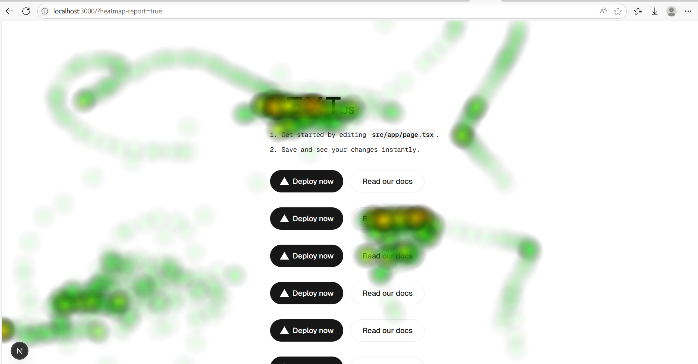

# Web HeatMap POC

```
const heatmap = new HeatMap({
  timeInterval: 5000,
  maxIntensity: 10,
  postEventsApi: 'http://localhost:3000/api/heatmap/events',
  getEventsApi: 'http://localhost:3000/api/heatmap/events',
  apiKey: 'test'
})

heatmap.track()

heatmap.report({
	site: 'localhost:3000',
	page: '/'
})
```

# Example

```
const heatmap = new HeatMap({
  timeInterval: 5000,
  maxIntensity: 10,
  postEventsApi: 'http://localhost:3000/api/heatmap/events',
  getEventsApi: 'http://localhost:3000/api/heatmap/events',
  apiKey: 'test'
})

export default function Home() {
  const searchParams = useSearchParams()
  const report = searchParams.get('heatmap-report')

  useEffect(() => {
    if (window) {
      if (report === 'true') {
        heatmap.report({
          site: 'localhost:3000',
          page: '/'
        })
      } else {
        heatmap.track()
      }
    }
  }, [report])

  return (<></>)
}
```

# Results


# Possibilities

Run that generated report by an AI/LLM to improve the UI/UX based on the report.

# Current Challenges

Although we're already converting traces to binary data before saving, and converting back to JSON when drawing in the report, 8 rows generated 352kb of data.